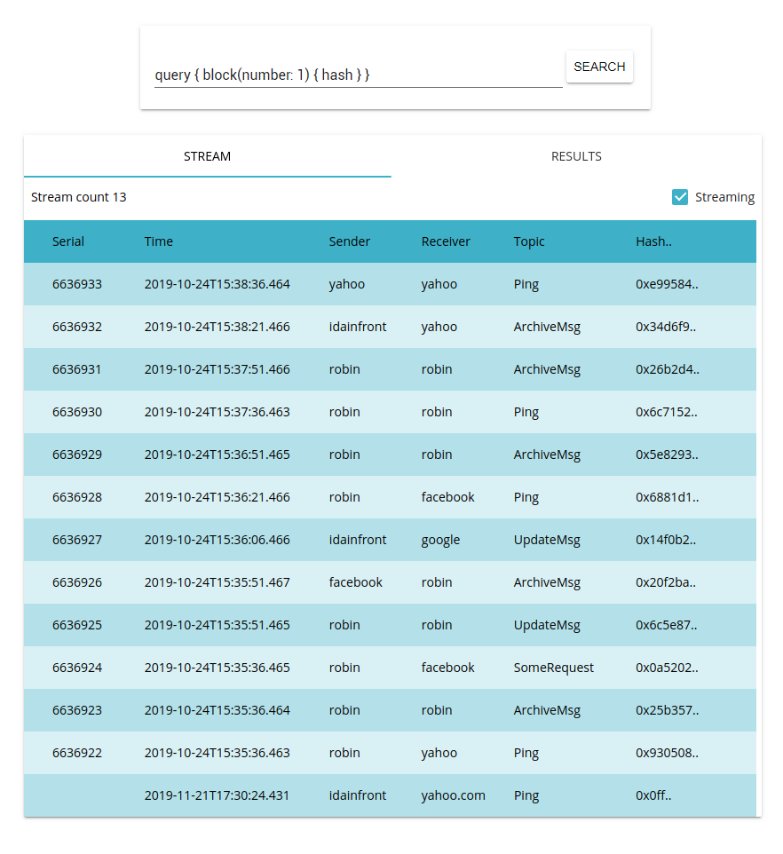

# Broker Ethereum

Augments the iipax platform with an Ethereum-based message broker.

Build with microservices and the following libs

- Hazelcast
- Web3j
- Vert.x (chili)
- Polymer 3 / web components
- ElasticSearch
- Kibana
- Geth 1.9.2

(beth is a workspace, websocket gateway, ethereum ingest and query)



NOTE: uses __block__ data enriched with mock whisper data as the whisper RPC calls isn't implemented in the Web3j client. 

### Build & Run

1. Build the jar dist

```console
./gradlew jar
```

2. Start geth ethereum client

```console
$ geth --testnet --graphql --shh --rpcapi admin,miner,eth,web3 --rpc console
```

Start all services in the same JVM

```console
java -jar <beth>.jar --deploy all
```

Websocket now deployed on :8080.

To host the UI during development run

```console
npm install
polymer serve
```

From the resouraces/web/ folder.

To build the distribution bundle run

```polymer
polymer build
```

### GraphQL

See: [bitfalls.com/exploring-ethereum-graphql](https://bitfalls.com/2018/08/01/ethql-exploring-ethereum-blockchain-graphql/)

Example query to grab block 0x1.
```json
query { block(number: 1) { hash } }
```
